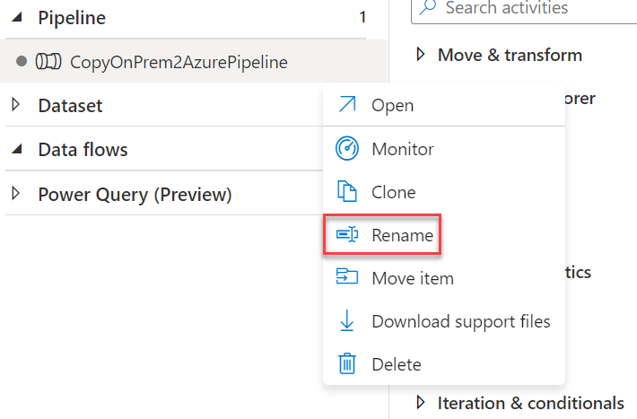

## Challenge 5: Operationalize ML scoring with Azure Databricks and Data Factory

Duration: 20 minutes

In this exercise, you will extend the Data Factory to operationalize data scoring using the previously created machine learning model within an Azure Databricks notebook.

### Task 1: Create Azure Databricks Linked Service

1. Return to, or reopen the Author & Monitor page for your Azure Data Factory in a web browser, navigate to the Author view **(1)**, and select the `CopyOnPrem2AzurePipeline` pipeline **(2)**.

   

   >**Note**: You may need to rename your pipeline if you followed the steps above. Simply press the three dots next to the pipeline and select **Rename**. Use `CopyOnPrem2AzurePipeline` as the new pipeline name.

   

2. Once there, expand Databricks under Activities.

   

3. Drag the Notebook activity onto the design surface to the side of the Copy activity.

   

4. Select the Notebook activity **(1)** on the design surface to display tabs containing its properties and settings at the bottom of the screen. On the **General (2)** tab, enter `BatchScore` into the **Name (3)** field.

   

5. Select the **Azure Databricks (1)** tab, and select **+ New (2)** next to the Databricks Linked service drop-down. Here, you will configure a new linked service that will serve as the connection to your Databricks cluster.

   

6. On the New Linked Service dialog, enter the following:

   - **Name**: `AzureDatabricks`
  
   - **Connect via integration runtime**: Leave set to Default.
  
   - **Account selection method**: **From Azure subscription**
  
   - **Azure subscription**: Choose your Azure Subscription.
  
   - **Databricks workspace**: Pick your Databricks workspace to populate the Domain automatically.
  
   - **Select cluster**: **Existing interactive cluster**

   - **Access token**:  Paste your Personal Access Token (PAT) that you saved earlier.

   - **Choose from existing clusters**:  Select **lab** from the drop-down list.

   Once you have entered this information, select **Create**.

   

7. Switch back to Azure Databricks. Select **Workspace > Users > BigDataVis** in the menu **(1)**. Select the **Exercise 5 (2)** folder, then open notebook **01 Deploy for Batch Scoring (3)**. Examine the content, but _don't run any of the cells yet_.

    

8.  Replace **`STORAGE-ACCOUNT-NAME`** with the name of the blob storage account you copied in Exercise 1 into Cmd 4.

    

9.  Switch back to your Azure Data Factory screen. Select the **Settings (1)** tab, then browse **(2)** to your **Exercise 5/01 Deploy for Batch Score** notebook **(3)** into the Notebook path field.

    

10. The final step is to connect the **Copy data** activity with the **Notebook** activity. Select the small green box on the side of the copy activity, and drag the arrow onto the Notebook activity on the design surface. What this means is that the copy activity has to complete processing and generate its files in your storage account before the Notebook activity runs, ensuring the files required by the BatchScore notebook are in place at the time of execution. Select **Publish All (1)**, then **Publish** the **CopyOnPrem2AzurePipeline**, after making the connection.

    

### Task 2: Trigger workflow

1. Switch back to Azure Data Factory. Select your pipeline if it is not already opened.

2. Select **Trigger**, then **Trigger Now** located above the pipeline design surface.

   

3. Enter `3/1/2017` into the **windowStart (1)** parameter, then select **OK (2)**.

   

4. Select **Monitor** in the menu. You will be able to see your pipeline activity in progress as well as the status of past runs.

   

   > **Note**: You may need to restart your Azure Databricks cluster if it has automatically terminated due to inactivity.