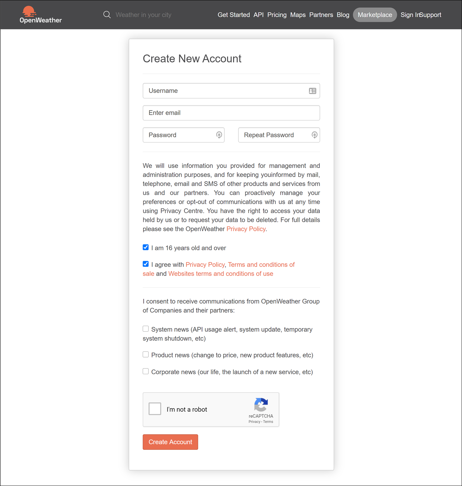
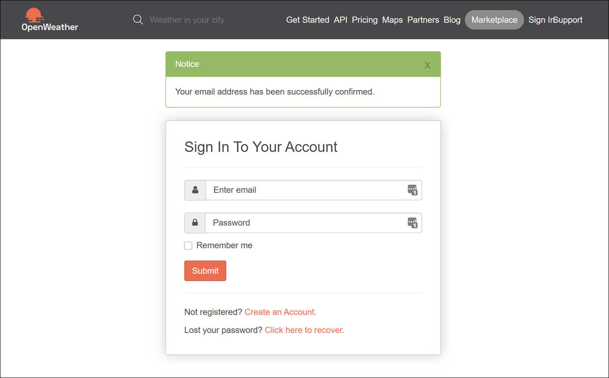
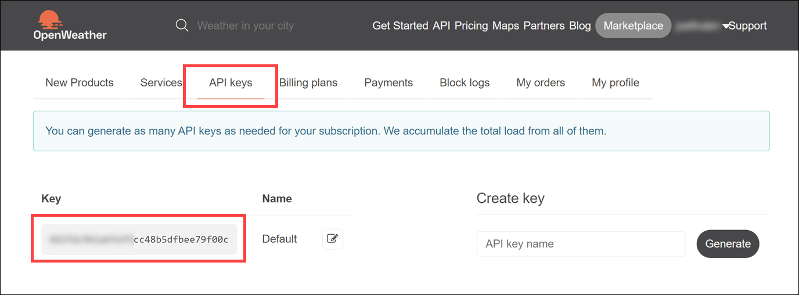
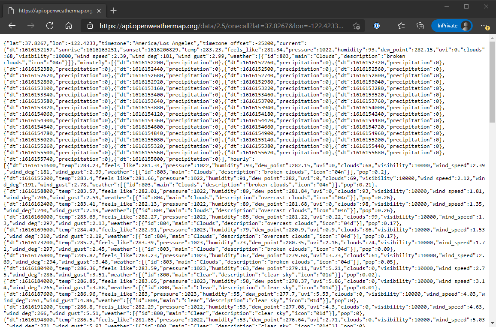
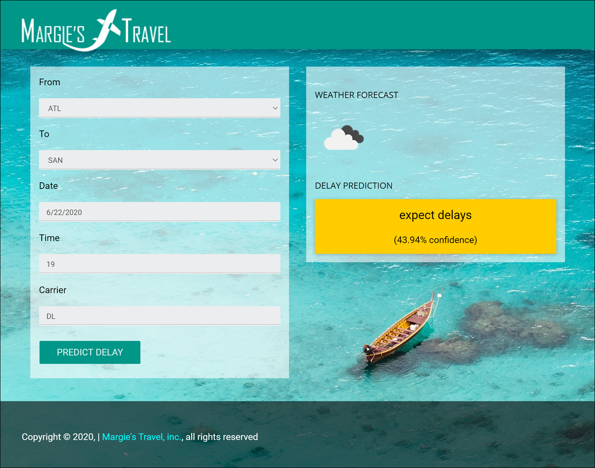

## Exercise 8: Deploy intelligent web app (Optional)

Duration: 20 minutes

In this exercise, you will deploy an intelligent web application to Azure from GitHub. This application leverages the operationalized machine learning model deployed in Exercise 1 to bring action-oriented insight into an already existing business process.

> **Please note**: If you are running your lab in a hosted Azure environment and do not have permissions to create a new Azure resource group, the automated deployment task (#2 below) may fail, even if you choose an existing resource group. The automated deployment will also fail if the user you are logged into the portal with is **not** a Service Administrator or a Co-Administrator. If this happens, we recommend that you install [Visual Studio 2017/2019 Community](https://visualstudio.microsoft.com/downloads/) or greater, then use the [Publish feature](https://docs.microsoft.com/visualstudio/deployment/quickstart-deploy-to-azure?view=vs-2019) to publish to a new Azure web app. You will then need to create and populate two new Application Settings as outlined in the tasks that follow: `mlUrl` and `weatherApiKey`. **Skip ahead to Task 3 for further instructions.**

### Task 1: Register for an OpenWeather account

To retrieve the 5-day hourly weather forecast, you will use an API from OpenWeather. There is a free version that provides you access to the API you need for this hands-on lab.

1. Navigate to <https://openweathermap.org/home/sign_up>.

2. Complete the registration form by providing your desired username, email address, and a password. Verify you are 16 years old and over, and agree to the privacy policy and terms of conditions. Select **Create Account**. If you already have an account, select **Sign in** at the top of the page instead.

   

3. Check your email account you used for registration. You should have a confirmation email from OpenWeather. Open the email and follow the email verification link within to complete the registration process. When the welcome page loads, log in with your new account.

   

4. After logging in, select the **API keys** tab. Take note of your Default **Key** and copy it to a text editor such as Notepad for later. You will need this key to make API calls later in the lab.

   

5. To verify that your API Key is working, replace **{YOUR API KEY}** in the following URL and paste the updated path to your browser's navigation bar: `https://api.openweathermap.org/data/2.5/onecall?lat=37.8267&lon=-122.4233&appid={YOUR API KEY}`. You should see a JSON result that looks similar to the following:

   >**Note**: If you send this request immediately after key creation, you may encounter a 401 response code. If so, wait for a couple of minutes.

   

### Task 2: Deploy web app from GitHub

1. Navigate to <https://github.com/Microsoft/MCW-Big-data-analytics-and-visualization/blob/main/Hands-on%20lab/lab-files/BigDataTravel/README.md> in your browser of choice, but where you are already authenticated to the Azure portal.

2. Read through the README information on the GitHub page.

3. Select **Deploy to Azure** button in the Readme.md file.

   

4. On the following page, ensure the fields are populated correctly.

   - Ensure the correct Directory and Subscription are selected.

   - Select the Resource Group that you have been using throughout this lab.

   - Either keep the default Site name, or provide one that is globally unique, and then choose a Site Location.

   - Enter the **OpenWeather API Key**.

   - Finally, enter the **ML URL**. We got this from Azure databricks Notebook #3 in the Exercise 2 folder.

   

5. Select **Review + create (4)**, and on the following screen, select **Create**.

6. The page should begin deploying your application while showing you a status of what is currently happening.

   > **Note**: If you run into errors during the deployment that indicate a bad request or unauthorized, verify that the user you are logged into the portal with an account that is either a Service Administrator or a Co-Administrator. You won't have permissions to deploy the website otherwise.

7. After a short time, the deployment will complete, and you will be able to access the web site.

8. Try a few different combinations of origin, destination, date, and time in the application. The information you are shown is the result of both the ML API you published, as well as information retrieved from the OpenWeather API.

   

9. Congratulations! You have built and deployed an intelligent system to Azure.

### Task 3: Manual deployment (optional)

**If the automated deployment from GitHub in the previous task failed**, follow these instructions to manually deploy.

1. Install [Visual Studio 2017/2019 Community](https://visualstudio.microsoft.com/downloads/) or greater. Make sure you select the **ASP.NET and web development** and **Azure development** workloads.

   

   > **Note**: If you are prompted to sign in to Visual Studio for the first time, enter the Azure account credentials you are using for this lab.

2. In a web browser, navigate to the [Big data analytics and visualization MCW repo](https://github.com/microsoft/MCW-Big-data-analytics-and-visualization).

3. On the repo page, select **Clone or download**, then select **Download ZIP**.

   

4. Unzip the contents to your root hard drive (i.e., `C:\`). This will create a folder on your root drive named `C:\MCW-Big-data-analytics-and-visualization-main`.

5. Open Windows Explorer and navigate to `C:\MCW-Big-data-analytics-and-visualization-main\Hands-on lab\lab-files\BigDataTravel\`, then open **BigDataTravel.sln**.

6. In the Visual Studio Solution Explorer, right-click on the BigDataTravel project, then select **Publish...**.

   

7. In the Publish dialog, select the **Azure (1)** as your publish target, select **Next (2)** to continue.

   

8. In the Specific target step, select the **Azure App Service (Windows) (1)** as your publish target, select **Next (2)** to continue.

   

9. In the App Service selection step, select the **+** **(1)** plus button to create a new App Service instance.

   > **WARNING**: When asked login with your Azure Subscription credentials.

   

10. Enter the following into the App Service form that follows, then select **Create**:

    - **Name (1)**: Enter a unique value.

    - **Subscription (2)**: Choose the Azure subscription you are using for the lab.

    - **Resource group (3)**: Select the Azure resource group you are using for the lab.

    - **Hosting Plan (4)**: Select **New**, then **Create (5)** a new Hosting Plan in the same location and the **Free** size.

    

11. Select the newly created App Service instance **(1)** and select **Finish (2)** to go back to Visual Studio.

    

12. Once you are back in Visual Studio select **Publish** to start the publishing process.

    

    > **Note**: If you receive an error concerning the Roslyn compiler, open the NuGet package manager interface (**Tools --> NuGet Package Manager --> Package Manager Console**) and run the command below to update the package. Then, publish the application again.
    >
    > ```PowerShell
    > Update-Package Microsoft.CodeDom.Providers.DotNetCompilerPlatform -r
    > ```

13. After publishing is completed, open the new App Service located in your resource group in the [Azure portal](https://portal.azure.com).

14. Select **Configuration** in the left-hand menu.

    

15. Select **Configuration (1)** in the left-hand menu. Create the two following **Application settings (3)**, then select **Save (4)**:

    - **mlUrl**: Enter the Machine Learning URL. We got this from Azure databricks Notebook #3 in the Exercise 2 folder. If you cleaned your resources at the end of this Notebook #3, you will need to re-run it and keep the web service running to get its associated URL.
  
    - **weatherApiKey**: Enter the OpenWeather API key.

    

You will now be able to successfully navigate the web app.
